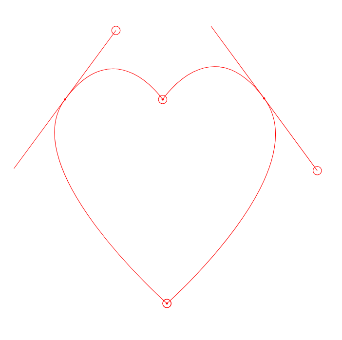

# bezierCurveJS
A simple implementation of a bezier curve tool

```html
<body style="overflow:hidden;margin:0px;">
	<script type="text/javascript" src="bezierCurve.js"></script>
	<script type="text/javascript">
		bezierCurveInit(document.body, 'black');
		document.body.onresize = function() {
			bezierCurveInit(document.body, 'black')
		}
	</script>
</body>
```

Light Background       |  Dark Background
:-------------------------:|:-------------------------:
  |  
